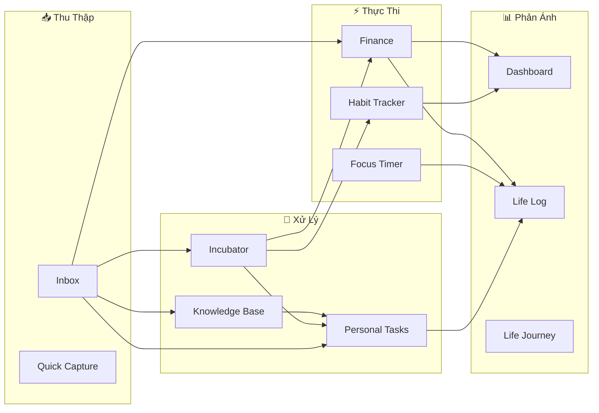

# 🧠 Phân Tích Tổng Thể Dự Án — Life Hub (Personal Life OS)

**Phân tích bởi:** CTO / Senior Engineer  
**Ngày:** 2026-06-13  
**Version hiện tại:** v4.22.0 (60+ releases trong ~2 tháng)

---

## 1. Tầm Nhìn Sản Phẩm

### Ý tưởng gốc
**"Bộ não thứ 2"** — một Personal Life OS tích hợp mọi khía cạnh cuộc sống vào 1 nền tảng duy nhất.

### Vị thế hiện tại



### Đánh giá: ⭐⭐⭐⭐ (4/5)

Ý tưởng **mạnh** vì:
- Giải quyết vấn đề thực tế: data phân tán khắp nơi (Notion, Todoist, Excel, notes app)
- Pipeline **Capture → Process → Execute → Reflect** là workflow tự nhiên
- Gamification (XP/Level/Streak) tạo động lực giữ chân user

Ý tưởng **yếu** ở:
- Scope quá rộng cho 1 người phát triển → rủi ro "jack of all trades, master of none"
- Chưa có differentiator rõ ràng so với Notion/Obsidian/ClickUp

---

## 2. Kiến Trúc Kỹ Thuật

### Stack

| Layer | Lựa chọn | Đánh giá |
|-------|----------|----------|
| Framework | React 19 + Vite 8 | ✅ Excellent — fast, modern |
| Routing | React Router v7 | ✅ Solid |
| Styling | Vanilla CSS + CSS Variables | ✅ Good — full control, no dependency |
| Backend | Supabase (PostgreSQL + Auth + Realtime) | ⚠️ Good nhưng rủi ro vendor lock-in |
| Hosting | Vercel | ✅ Great cho MVP |

### Cấu trúc code

| Metric | Giá trị | Đánh giá |
|--------|---------|----------|
| Pages | 15 files | ⚠️ Nhiều — một số page quá lớn |
| Hooks | 21 files | ⚠️ Nhiều — coupling giữa hooks |
| Biggest file | CollectPage.jsx (79KB) | 🔴 God component |
| 2nd biggest | TrackerPage.jsx (56KB) | 🔴 God component |
| 3rd biggest | IncubatorPage.jsx (44KB) | ⚠️ Large |
| CSS files | 32 files | ⚠️ Có duplicate patterns |
| DB tables | ~25+ tables | ✅ Well-structured |
| Total features | 23+ major features | ⚠️ Feature overload |

### Architectural Strengths ✅

1. **Supabase-first dual-mode**: Elegant approach — guest in-memory, authed Supabase. One-time migration on first login.
2. **Hook-per-domain**: Each feature has its own hook → clean separation of concerns.
3. **Static data in JSON** (Rule 14): Challenges, quiz, habits data externalized → non-dev editable.
4. **Lazy loading**: All pages lazy-loaded → good initial bundle size.
5. **Activity Log**: Central `activity_logs` table captures ALL user actions → powerful for analytics.
6. **Journey-as-Context**: Single source of truth pattern via React Context → prevents N+1 fetches.

### Architectural Weaknesses 🔴

1. **God Components**: 3 files over 40KB each — unmaintainable, un-testable, un-reviewable.
2. **No API layer**: All hooks directly import Supabase client → impossible to swap backend.
3. **No state management**: Each hook manages its own state → no shared cache, potential stale data.
4. **No error boundary per route**: Single global ErrorBoundary → one crash kills entire app.
5. **CSS without design system**: 32 CSS files with repeated patterns, no utility classes.
6. **No TypeScript**: 21 hooks + 15 pages with zero type safety → runtime bugs in production.

---

## 3. Feature Inventory & Priority Matrix

### Phân loại theo giá trị vs complexity

```
HIGH VALUE
    │
    │  ⭐ Habit Tracker     ⭐ Knowledge Base     ⭐ Finance
    │  ⭐ Inbox/Capture     ⭐ Personal Tasks
    │  ✅ Focus Timer       ✅ Dashboard           ✅ Incubator
    │  ✅ Life Log          ✅ Journey System
    │
    │  ⚠️ Quiz              ⚠️ Leaderboard        ⚠️ Life Journey
    │  ❌ Team (archived)   ❌ Friends (archived)
    │
LOW VALUE ──────────────────────────────────────── HIGH COMPLEXITY
```

### Core Features (nên giữ & polish)

| # | Feature | Vì sao |
|---|---------|--------|
| 1 | **Habit Tracker** | Core loop — mọi thứ xoay quanh nó |
| 2 | **Inbox + KB** | Capture → Process pipeline — differentiator chính |
| 3 | **Finance** | Thực tế, dùng hàng ngày, data có giá trị tích lũy |
| 4 | **Tasks** | Productivity core — mọi app đều cần |
| 5 | **Life Log** | Reflection loop — kết nối mọi feature |

### Secondary Features (giữ nhưng freeze development)

| # | Feature | Vì sao |
|---|---------|--------|
| 6 | Focus Timer | Hoàn thiện, ít bug, ít cần thay đổi |
| 7 | Dashboard | Read-only aggregation — chỉ cần fix data source |
| 8 | Journey | Complex nhưng đã ổn, Optional (v4.21.0) |
| 9 | Incubator | Niche nhưng unique — friction UX tốt |

### Candidates for Removal/Simplification

| # | Feature | Lý do |
|---|---------|-------|
| 10 | Quiz | Vanity feature — 21 câu cố định, không scale, không replayable |
| 11 | Leaderboard | Social feature nhưng app đã pivot to personal |
| 12 | Life Journey | localStorage-only, không sync, data dễ mất |
| 13 | XP/Level System | Gamification mạnh nhưng 6 levels quá ít → ceiling effect |

---

## 4. Rủi Ro & Nợ Kỹ Thuật

### 🔴 Critical Risks

| Risk | Impact | Likelihood | Mitigation |
|------|--------|------------|------------|
| **God components crash** | App unusable | High | Split into sub-components |
| **No TypeScript** | Silent bugs in production | Medium | Gradual migration (.js → .ts) |
| **Supabase vendor lock-in** | Can't switch backend | Medium | Abstract into API layer |
| **Single developer** | Bus factor = 1 | High | Documentation (đang làm tốt) |
| **60+ versions in 2 months** | Velocity > stability | High | Feature freeze + polish sprint |

### ⚠️ Technical Debt Inventory

| Debt | Files affected | Effort |
|------|---------------|--------|
| God components (>40KB) | 3 files | 2-3 days each |
| `console.*` → logger | ~~27 files~~ ✅ Done | — |
| `toLocaleDateString` → dateUtils | 14 files | 1 day |
| eslint-disable audit | 15 instances | 0.5 day |
| Per-route ErrorBoundary | App.jsx + 15 pages | 1 day |
| CSS dedup & design tokens | 32 CSS files | 3 days |
| TypeScript migration | All files | 2 weeks |

---

## 5. User Flow Analysis

### Luồng chính (Happy Path)

```
Landing → Login → Tracker (Today)
  ├─ Tick habits → XP → Level up
  ├─ Quick Capture [+] → Inbox
  │   ├─ Classify → Knowledge Base
  │   ├─ → Task
  │   ├─ → Expense
  │   └─ → Incubator → defer/execute
  ├─ Focus Timer → Session log → Life Log
  └─ Finance → Expense/Sub tracking → Dashboard
```

### UX Gaps Identified

1. **Guest → Auth friction**: Guest có thể browse nhưng data mất khi refresh → user có thể ko hiểu value trước khi signup
2. **No onboarding flow post-login**: Sau login, user bị thrown vào Tracker trống → không biết bắt đầu từ đâu nếu chưa chọn Journey
3. **Information density**: TrackerPage quá nhiều sections → overwhelming cho new user
4. **Mobile UX**: 15 pages qua 6 primary tabs + 6 secondary → navigation overload trên mobile
5. **No search global**: User phải nhớ data ở đâu (Inbox? KB? Tasks?) → cognitive load

---

## 6. So Sánh Thị Trường

| Feature | Life Hub | Notion | Obsidian | Habitica | ClickUp |
|---------|----------|--------|----------|----------|---------|
| Habit Tracking | ⭐⭐⭐⭐⭐ | ❌ | Plugin | ⭐⭐⭐⭐ | ❌ |
| Knowledge Base | ⭐⭐⭐ | ⭐⭐⭐⭐⭐ | ⭐⭐⭐⭐⭐ | ❌ | ⭐⭐ |
| Finance | ⭐⭐⭐ | Template | ❌ | ❌ | ❌ |
| Task Management | ⭐⭐⭐ | ⭐⭐⭐⭐ | Plugin | ⭐⭐ | ⭐⭐⭐⭐⭐ |
| Gamification | ⭐⭐⭐⭐ | ❌ | ❌ | ⭐⭐⭐⭐⭐ | ❌ |
| Focus Timer | ⭐⭐⭐⭐ | ❌ | Plugin | ❌ | Timer |
| Inbox/Capture | ⭐⭐⭐⭐ | ⭐⭐⭐ | ⭐⭐⭐ | ❌ | ⭐⭐⭐ |
| **All-in-one** | **⭐⭐⭐⭐** | ⭐⭐⭐ | ⭐⭐ | ⭐⭐ | ⭐⭐⭐ |

### Competitive Advantage (Unique Selling Points)

1. **Habit + Finance + Knowledge trong 1 app** — không ai khác làm
2. **Gamification có nghĩa** — XP từ real actions, không phải fake rewards
3. **Vietnamese-first UX** — localized hoàn toàn, chưa ai phục vụ thị trường VN
4. **Incubator (Someday-Maybe với friction)** — unique concept, không có trong bất kỳ app nào
5. **Life Log heatmap** — GitHub-style cho cuộc sống, visual powerful

---

## 7. Khuyến Nghị Chiến Lược

### Ngắn hạn (1-2 tuần)

> [!IMPORTANT]
> **FEATURE FREEZE** — Không thêm feature mới. Focus hoàn toàn vào stability.

1. ✅ Hoàn tất Logger migration (DONE)
2. ⬜ dateUtils refactoring (14 files)
3. ⬜ eslint-disable audit (15 instances)
4. ⬜ Per-route ErrorBoundary
5. ⬜ Fix God components (CollectPage 79KB, TrackerPage 56KB, IncubatorPage 44KB)

### Trung hạn (1-2 tháng)

> [!TIP]
> **Polish Sprint** — Làm những gì đã có trở nên xuất sắc.

1. **Global Search**: Ctrl+K search across Inbox, KB, Tasks, Finance — biggest UX gap hiện tại
2. **Mobile PWA polish**: Offline support thật sự, push notifications, install prompt
3. **Guided onboarding v2**: Interactive tour cho new user (không chỉ 3 slides)
4. **Performance**: React.memo, virtualized lists cho KB (có thể hàng trăm articles)
5. **API abstraction layer**: Tách Supabase client khỏi hooks → future backend flexibility

### Dài hạn (3-6 tháng)

> [!WARNING]
> **Quyết định kiến trúc lớn cần thực hiện.**

1. **TypeScript migration**: Gradual, bắt đầu từ hooks → components → pages
2. **Xem xét loại bỏ**: Quiz, Leaderboard, Friends (archived), Team (archived) — dead weight
3. **AI Integration**: Tận dụng `body_text` + `word_count` đã chuẩn bị → AI summarize, auto-tag, smart search
4. **Multi-platform**: React Native hoặc Capacitor cho mobile native → push notifications thực sự
5. **Monetization strategy**: Freemium (5 habits free, unlimited = paid?) — cần quyết định trước khi public launch

---

## 8. Verdict — Tổng Kết

### Điểm Mạnh
- ✅ Velocity cực cao (60+ versions trong 2 tháng)
- ✅ Feature coverage toàn diện — thực sự là "Life OS"
- ✅ Documentation discipline tuyệt vời (FEATURES.md, PLAN.md, ARCHITECTURE.md)
- ✅ Data model sạch, RLS security đúng chuẩn
- ✅ Vietnamese-first — thị trường chưa ai phục vụ nghiêm túc

### Điểm Yếu
- 🔴 Feature overload → quality < quantity ở một số nơi
- 🔴 3 God components là ticking time bomb
- 🔴 No TypeScript → production bugs inevitable
- 🔴 Solo developer → bus factor = 1, burnout risk

### Score Card

| Dimension | Score | Notes |
|-----------|-------|-------|
| Vision | 9/10 | Rõ ràng, unique, có market |
| Execution | 7/10 | Fast nhưng debt accumulating |
| Architecture | 6/10 | Solid foundation, bad scaling patterns |
| UX/Design | 8/10 | Glassmorphism đẹp, nhưng information overload |
| Documentation | 9/10 | Best-in-class cho solo project |
| Sustainability | 5/10 | Feature velocity > stability → burnout risk |

### Một câu tổng kết

> **Life Hub có vision tuyệt vời và execution ấn tượng, nhưng đang ở giai đoạn nguy hiểm: đủ lớn để khó maintain, chưa đủ polish để launch public. Ưu tiên số 1 bây giờ là FEATURE FREEZE + POLISH, không phải thêm feature mới.**
